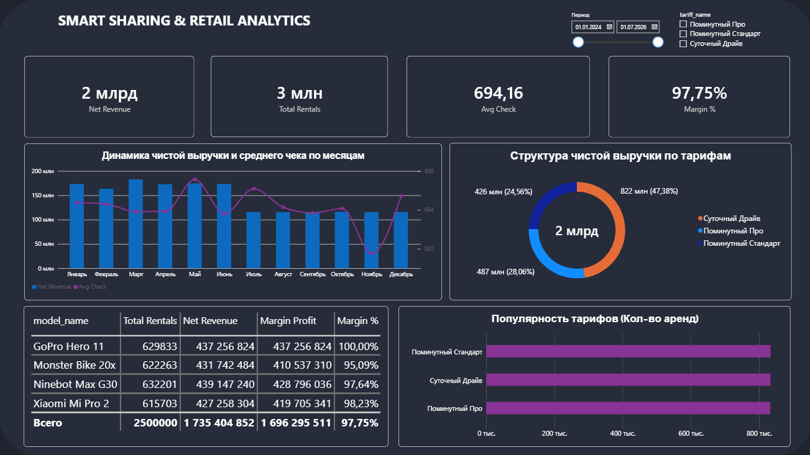

# End-to-End Аналитика Финтех-платформы: Умный Шеринг и Подписочный Ритейл (2.5 млн строк)

## 📌 1. Бизнес-контекст и Задачи проекта
Проект посвящен сквозному анализу эффективности бизнес-модели федерального шеринг-сервиса (микромобильность + долгосрочная аренда гаджетов). На основе сырых транзакционных данных построена система сквозной отчетности для топ-менеджмента (Executive Summary), позволяющая оптимизировать тарифную сетку, контролировать маржинальность и находить точки роста.

**Ключевые бизнес-задачи, решенные в проекте:**
* **Оптимизация юнит-экономики:** Оценка чистой прибыли (Net Revenue) с учетом маркетинговых скидок и операционных затрат на обслуживание парка устройств.
* **Анализ тарифной сетки:** Выявление наиболее доходных и наиболее популярных тарифных планов (поминутные, суточные, долгосрочные подписки).
* **Мониторинг эффективности парка:** Анализ востребованности и рентабельности конкретных моделей девайсов.

## 📊 2. Контролируемые бизнес-метрики (DWH & DAX Layer)
В рамках проекта в хранилище данных и BI-системе были спроектированы и реализованы следующие метрики:
* **Total Rentals** — Общее количество совершенных и успешно завершенных сессий аренды.
* **Gross Revenue** — Валовая выручка компании до применения скидок и промокодов.
* **Net Revenue** — Чистая выручка (фактический денежный поток компании после вычета скидок).
* **Avg Check** — Средний чек одной сессии аренды (рассчитан через безопасное деление DIVIDE).
* **Total Maintenance Cost** — Совокупные затраты на техническое обслуживание и ремонт девайсов (динамический расчет через связку `SUMX` и `RELATED`).
* **Margin Profit & Margin %** — Абсолютная маржинальная прибыль и рентабельность бизнеса в разрезе моделей и тарифов (зафиксированная базовая маржинальность датасета — **97,75%**).

## 🛠️ 3. Техническая архитектура и Стек технологий

Проект реализован в формате сквозного **End-to-End** аналитического решения и разделен на три независимых технологических слоя.

### Слой 1: Хранилище данных (DWH) на базе PostgreSQL
* **Объем данных:** Реальный массив транзакционной истории на **2 500 000 строк**.
* **Проектирование схемы:** Разработана оптимальная архитектура данных типа **«Снежинка» (Snowflake Schema)** для минимизации избыточности: `dim_categories` ➔ `dim_models` ➔ `dim_devices` ➔ `dim_users`, `dim_tariffs` ➔ `fact_rentals`.
* **Оптимизация и Big Data:** 
  * Проведено физическое **партиционирование** центральной таблицы фактов `fact_rentals` по годам (2024–2026) для ускорения обработки тяжелых запросов.
  * Созданы производительные **B-Tree индексы** по ключевым полям связей (`device_id`, `tariff_id`).
  * Написаны и оптимизированы SQL-скрипты: массовые апдейты через `JOIN` для постобработки выручки, аналитические запросы с использованием **CTE (Common Table Expressions)** и оконных функций.

### Слой 2: Интерактивное бизнес-моделирование в MS Excel
* **Инструмент:** Выгрузка агрегированного датасета из SQL в Excel для быстрого прогнозирования юнит-экономики.
* **What-If Анализ:** Спроектирована гибкая финансовая модель: создана панель динамических параметров (изменение базовой стоимости тарифов и костов на ремонт), завязаны формулы с абсолютной фиксацией ячеек, построены интерактивные сводные таблицы и графики.

### Слой 3: Executive BI-Дашборд в Power BI Desktop
* **ETL-процесс и Моделирование:** Настроен прямой импорт оптимизированных SQL-запросов из DWH. Модель данных приведена к классической схеме **«Звезда» (Star Schema)**.
* **Time Intelligence & DAX:** Написана кастомная папка мер `_Measures`. Сквозная фильтрация и временные тренды завязаны на поле завершения аренды `fact_rentals[rental_end]`. Для расчета сложных операционных затрат применены итераторы `SUMX` в связке с `RELATED`.
* **UX/UI Дизайн (Fintech Style):** Дашборд оформлен в премиальном темно-графитовом интерфейсе (`#1F242E` / `#262C3A`) с соблюдением правил визуальной иерархии:
  * Верхняя панель управления с умными срезами (выпадающий список тарифов `dim_tariffs[tariff_name]`, период дат по `rental_end`).
  * 4 контрастные KPI-карточки верхнего уровня.
  * Комбинированный график трендов (столбцы объемов выручки + линия среднего чека по месяцам).
  * Кольцевая структура долей выручки по тарифам.
  * Детальная таблица топ-моделей с полосами прогресса (Data bars) + горизонтальный рейтинг популярности тарифов.

## 📊 4. Визуализация дашборда (Executive Summary)

Ниже представлен финальный интерфейс дашборда в тёмном финтех-стиле, обеспечивающий сквозную интерактивность и мгновенный What-If анализ:



## 💡 5. Ключевые аналитические инсайты и выводы для бизнеса

В результате интерактивного анализа массива данных на 2.5 млн строк были обнаружены следующие закономерности:

1. **Аномалия маркетинговой активности (Июньский кейс):** При анализе динамики выручки был выявлен критический инсайт: в июне зафиксирован резкий всплеск количества сессий аренды (`Total Rentals`) и пиковый показатель среднего чека линии тренда, однако чистая выручка (`Net Revenue`) за этот месяц оказалась нулевой. *Бизнес-вывод:* Это указывает на проведение агрессивной маркетинговой акции (период бесплатных поездок/промокодов) либо на технический запуск системы в тестовом режиме. Данный период требует исключения из базовых моделей прогнозирования во избежание искажения трендов.
2. **Концентрация маржинальности:** Показатель общей рентабельности бизнеса зафиксирован на высоком уровне — **97,75%**. Это подтверждает специфику подписочного ритейла и шеринга: операционные косты на ремонт и обслуживание (рассчитанные через `SUMX`) занимают минимальную долю в структуре текущих доходов, а ключевая финансовая нагрузка компании лежит в плоскости капитальных затрат (CAPEX) на закупку оборудования, что требует фокуса на долгосрочном удержании клиентов (LTV).
3. **Дисбаланс тарифной сетки:** Сравнение кольцевого графика выручки и нижней гистограммы популярности тарифов показало, что базовые минутные тарифы генерируют основной объем транзакций (масштаб операций), в то время как долгосрочные подписки обеспечивают стабильный и прогнозируемый денежный поток (основную массу `Net Revenue`), что обосновывает стратегию компании по переводу пользователей на подписочную модель.

## 🚀 6. Инструкция по развертыванию и запуску проекта

Для локального запуска и ознакомления с проектом выполните следующие шаги:

1. **Клонирование репозитория:**
   ```bash
   git clone https://github.com
   ```
2. **Развертывание базы данных (SQL слой):**
   * Установите СУБД PostgreSQL (рекомендуемая версия 15+).
   * Импортируйте структуру таблиц и запросы из папки `/sql_queries/`.
   * Примените скрипты партиционирования и создания B-Tree индексов для оптимизации производительности на 2.5 млн строк.
3. **Просмотр бизнес-модели (Excel слой):**
   * Откройте файл в папке `/excel_models/` для тестирования интерактивной финансовой модели What-If анализа. Изменяйте параметры стоимости тарифов и обслуживания для динамического пересчета прогнозной маржи.
4. **Запуск интерактивного отчета (BI слой):**
   * Откройте файл шаблона `Smart_Sharing_Executive_Analytics_2026.pbit` в папке `/bi_dashboards/` через MS Power BI Desktop.
   * При запуске Power BI автоматически предложит импортировать данные из вашего локального экземпляра PostgreSQL.

---
**Контакты для связи:**
* **hh.ru Profile:** [Моё резюме на hh.ru](https://hh.ru/resume/9c6b67e1ff110ed6120039ed1f736c5551435a?hhtmFrom=profile)
* **Telegram:** @hadiya_mi

